# grafana-monitoring-elastic-tick-kafka-ksql-c3-prometheus

# 🚀 Docker - ELK - Tick Stack - Grafana - Kafka 🚀

https://github.com/coding-to-music/grafana-monitoring-elastic-tick-kafka-ksql-c3-prometheus

From / By Florent Ramière https://github.com/framiere/monitoring-demo

https://github.com/framiere/monitoring-demo

https://jdbranham.github.io/grafana-diagram/

http://localhost:3000 Grafana

http://localhost:5601 Kibana

http://localhost:8888 Chronograf

## Environment variables:

```java

```

## Useful Commands:

```java

# running containers
docker ps -a

alias dil="docker images"
```

## Useful Docker Aliases:

```java
# General
alias dve="docker -v"
alias dl="docker login --username=dragol"
# Explanation
# dve - prints out current docker version
# dl - docker login, will prompt you for password

# Images
alias dil="docker images"
alias dip="docker image prune -f"
# Explanation
# dil - list all docker images available on my machine
# dip - remove all dangling images -f is flag for force

# Containers
alias dcl="docker ps"
alias dcla="docker ps -a"
alias dcp="docker container prune -f"
alias dci="docker inspect"
alias dciip="docker inspect -f \"{{ .NetworkSettings.IPAddress }}\""
alias dcs="docker start"
alias dcd="docker down"
alias dcr="docker restart"
# Explanation
# dcl - list running containers
# dcla - list all containers
# dcp - remove all dangling containers
# dci - here you need to pass container id in order to get various information about particular container
# dciip - returns container IP address
# dcs - here you need to pass container id in order to start container
# dcd - here you need to pass container id in order to stop container
# dcr - here you need to pass container id in order to restart container

# Networks
alias dnl="docker network ls"
alias dni="docker network inspect"
alias dnrm="docker network rm"
alias dnp="docker network prune -f"
# Explanation
# dnl - list networks
# dni - here you need to pass network id in order to see its details
# dnrm - here you need to pass network id in order to delete it
# dnp - remove all dangling networks

# Volumes
alias dvc="docker volume create"
alias dvl="docker volume ls"
alias dvrm="docker volume rm"
alias dvp="docker volume prune -f"
alias dvi="docker volume inspect"
# Explanation
# dvc - here you need to pass volume name in order to create it
# dvl - list volumes
# dvrm - here you need to pass volume id in order to delete it
# dvp - remove all dangling volumes
# dvi - here you need to pass volumeid in order to see its details

# Docker-Compose
alias dcv="docker-compose -v"
alias dcu="docker-compose up"
alias dcd="docker-compose down"
alias dcb="docker-compose build --no-cache"
alias dcc="docker-compose config"
# Explanation
# dcv - prints out docker compose version
# dcu - start docker compose
# dcd - stop docker compose
# dcb - new docker compose build from ground up
# dcc - check if docker-compose.yml file is valid
```

## GitHub

```java
git init
git add .
git remote remove origin
git commit -m "first commit"
git branch -M main
git remote add origin git@github.com:coding-to-music/grafana-monitoring-elastic-tick-kafka-ksql-c3-prometheus.git
git push -u origin main
```

# 1. Introduction

This project is about giving you a step by step introduction on how to leverage docker and the open-source ecosystem to do metrics/logs/alerting.

**Note:** This project is _only_ intended to present ideas.

**Note:** if you are using [docker for mac](https://docs.docker.com/docker-for-mac/) please assign at least 5go of memory.

<!-- TOC -->

- [1. Introduction](#1-introduction)
- [2. container logging](#2-container-logging)
- [3. Listening for logs using a container](#3-listening-for-logs-using-a-container)
- [4. Elasticsearch](#4-elasticsearch)
- [5. Elasticsearch Metrics !](#5-elasticsearch-metrics)
- [6. Better metrics: the TICK stack](#6-better-metrics-the-tick-stack)
- [7. Getting the best of the ecosystem](#7-getting-the-best-of-the-ecosystem)
- [8. Kafka the data hub](#8-kafka-the-data-hub)
- [9. Enter JMX !](#9-enter-jmx)
- [10. Let's do some manual monitoring](#10-lets-do-some-manual-monitoring)
- [11. Self descriptive visualizations](#11-self-descriptive-visualizations)
- [12. Your sql databases are back](#12-your-sql-databases-are-back)
- [13. Share your database tables as kafka table](#13-share-your-database-tables-as-kafka-table)
- [14. Going even further with Kafka using KSQL](#14-going-even-further-with-kafka-using-ksql)
- [15. Going C3](#15-going-c3)
- [16. Going Prometheus](#16-going-prometheus)
- [17. Going distributed open tracing](#17-going-distributed-open-tracing)
- [18. Monitoring Federation](#18-monitoring-federation)
- [19. Security](#19-security)

<!-- /TOC -->

# 2. container logging

In `docker-compose-step1.yml` we create a simple container that displays hello world

The container definition is as follows

```yaml
example:
  image: ubuntu
  command: echo hello world
```

Run it with `docker-compose -f docker-compose-step1.yml up`

```bash
docker-compose -f docker-compose-step1.yml up
```

Output:

```bash
Creating network "monitoring-demo_default" with the default driver
Creating grafana-monitoring-elastic-tick-kafka-ksql-c3-prometheus_example_1 ...
Creating grafana-monitoring-elastic-tick-kafka-ksql-c3-prometheus_example_1 ... done
Attaching to grafana-monitoring-elastic-tick-kafka-ksql-c3-prometheus_example_1
example_1  | hello world
grafana-monitoring-elastic-tick-kafka-ksql-c3-prometheus_example_1 exited with code 0
```

`Hello world` has been writen on `stdout`. How fancy !

The output of the container has also been captured by docker.

Run `docker logs grafana-monitoring-elastic-tick-kafka-ksql-c3-prometheus_example_1` you should see

```bash
$ docker logs grafana-monitoring-elastic-tick-kafka-ksql-c3-prometheus_example_1
hello world
```

When outputing to `stdout` and `stderr` docker captures these logs and send them to the log bus. A listener listen to logs and store container logs into their own log file.

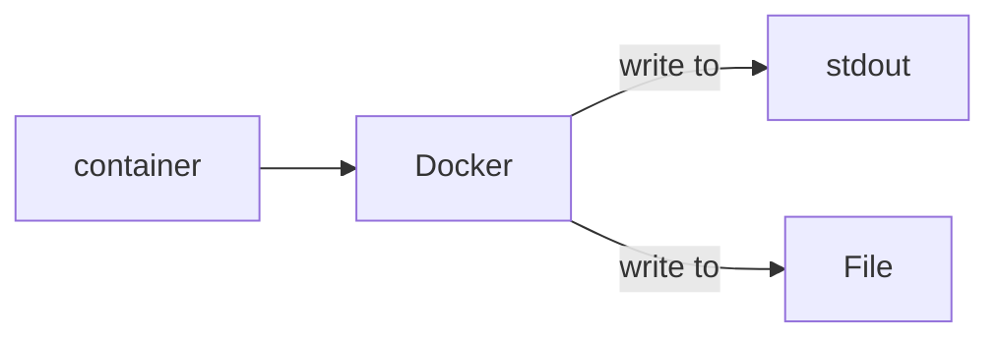

In order to know where it's stored just inspect the container with `docker inspect grafana-monitoring-elastic-tick-kafka-ksql-c3-prometheus_example_1` you should see

```bash
$ docker inspect grafana-monitoring-elastic-tick-kafka-ksql-c3-prometheus_example_1
[
    {
        "Id": "cf1a86e1dc9ac16bc8f60b234f9b3e6310bd591dc385bc1da8e1081d2837752a",
        "Created": "2017-10-24T21:24:57.558550709Z",
        "Path": "echo",
        "Args": [
            "hello",
            "world"
        ],
        "State": {
            "Status": "exited",
            "Running": false,
            "Paused": false,
            "Restarting": false,
...
... snip snip ...
...
            }
        }
    }
]
```

That's a lot of different information, let's look for the log info

```bash
$ docker inspect grafana-monitoring-elastic-tick-kafka-ksql-c3-prometheus_example_1 | grep log
        "LogPath": "/var/lib/docker/containers/cf1a86e1dc9ac16bc8f60b234f9b3e6310bd591dc385bc1da8e1081d2837752a/cf1a86e1dc9ac16bc8f60b234f9b3e6310bd591dc385bc1da8e1081d2837752a-json.log",
```

Perfect, let's extract that field now with [jq](https://stedolan.github.io/jq/)

```bash
$ docker inspect grafana-monitoring-elastic-tick-kafka-ksql-c3-prometheus_example_1 | jq -r '.[].LogPath'
/var/lib/docker/containers/cf1a86e1dc9ac16bc8f60b234f9b3e6310bd591dc385bc1da8e1081d2837752a/cf1a86e1dc9ac16bc8f60b234f9b3e6310bd591dc385bc1da8e1081d2837752a-json.log
```

**Note:** you will not to be able to read this file directly using [docker for mac](https://docs.docker.com/docker-for-mac/).

More about logs : https://docs.docker.com/engine/admin/logging/overview/#use-environment-variables-or-labels-with-logging-drivers

# 3. Listening for logs using a container

The objective now is to leverage the docker event bus, listen to it and output it on the console.

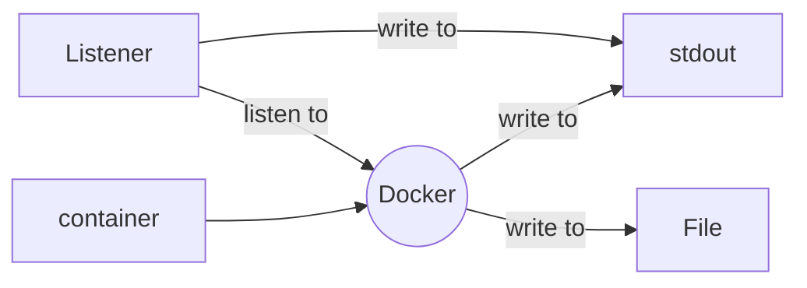

Therefore we should see **twice** anything that is outputed on `stdout`.

We will use [logspout](https://github.com/gliderlabs/logspout) to listen for all the docker logs.

```yaml
logspout:
  image: bekt/logspout-logstash
  restart: on-failure
  volumes:
    - /var/run/docker.sock:/tmp/docker.sock
  environment:
    ROUTE_URIS: logstash://logstash:5000
  depends_on:
    - logstash
```

_Note:_ In order to read from the log bus, we need to access the docker socket. This the volume mapping configuration.

Once `logspout` gets a log, it sends it `logstash`.

[logstash](https://www.elastic.co/guide/en/logstash/current/index.html)`Logstash` is defined as follows

```yaml
logstash:
  image: logstash
  restart: on-failure
  command: -e "input { udp { port => 5000 codec => json } } filter { if [docker][image] =~ /^logstash/ {  drop { } } } output { stdout { codec => rubydebug } }"
```

Here I define a complete `logstash` configuration on the command line.

_Note:_ `logspout` will send all logs event from `logstash`, filter the `logstash` one to prevent infinite printing.

So here is are the containers at play:

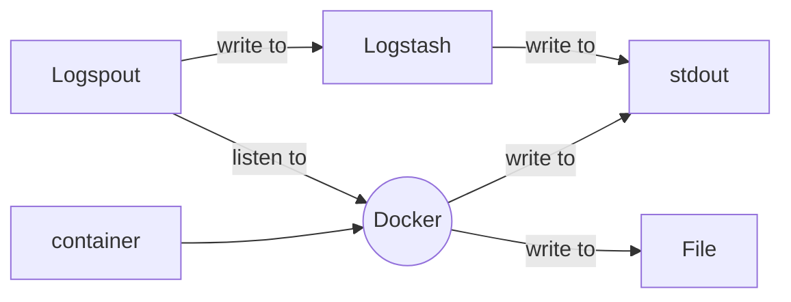

Run the demo with `docker-compose -f docker-compose-step2.yml up`, you should see

```bash
$ docker-compose -f docker-compose-step2.yml up
Recreating monitoring-demo_logstash_1 ...
Recreating monitoring-demo_logstash_1
Starting grafana-monitoring-elastic-tick-kafka-ksql-c3-prometheus_example_1 ...
Recreating monitoring-demo_logstash_1 ... done
Recreating monitoring-demo_logspout_1 ...
Recreating monitoring-demo_logspout_1 ... done
Attaching to grafana-monitoring-elastic-tick-kafka-ksql-c3-prometheus_example_1, monitoring-demo_logstash_1, monitoring-demo_logspout_1
example_1   | 11597
example_1   | 9666
example_1   | 3226
...
... snip snip ...
...
example_1   | 10854
logstash_1  | {
logstash_1  |     "@timestamp" => 2017-10-24T21:49:09.787Z,
logstash_1  |         "stream" => "stdout",
logstash_1  |       "@version" => "1",
logstash_1  |           "host" => "172.24.0.4",
logstash_1  |        "message" => "10854",
logstash_1  |         "docker" => {
logstash_1  |            "image" => "ubuntu",
logstash_1  |         "hostname" => "15716aaf6095",
logstash_1  |             "name" => "/grafana-monitoring-elastic-tick-kafka-ksql-c3-prometheus_example_1",
logstash_1  |               "id" => "15716aaf6095efdde8ab3e566a911aac284e63d3c949dd19ddfd64258d20de9b",
logstash_1  |           "labels" => nil
logstash_1  |     },
logstash_1  |           "tags" => []
logstash_1  | }
```

**Note:** Along the message is container metadata! This will be of **tremendous** help while debugging your cluster !

# 4. Elasticsearch

It's kind of silly to grab stdout in such a convoluted way to export it back to `stdout`.

Let's make something useful such as sending all the logs to [elasticsearch](https://www.elastic.co/guide/en/elasticsearch/reference/current/index.html).

Let's define first an elasticsearch server

```yaml
elasticsearch:
  image: docker.elastic.co/elasticsearch/elasticsearch:5.6.0
  restart: on-failure
  ports:
    - "9200:9200"
    - "9300:9300"
  environment:
    xpack.security.enabled: "false"
```

and it's [kibana](https://www.elastic.co/guide/en/kibana/current/index.html) companion

```yaml
kibana:
  image: docker.elastic.co/kibana/kibana:5.5.2
  restart: on-failure
  ports:
    - "5601:5601"
  environment:
    xpack.security.enabled: "false"
  depends_on:
    - elasticsearch
```

Let's as logstash to send all logs not to `stdout` but to `elasticsearch` now.

```bash
-e "input { udp { port => 5000 codec => json } } filter { if [docker][image] =~ /^logstash/ {  drop { } } } output { stdout { codec => rubydebug } }"
```

becomes

```bash
-e "input { udp { port => 5000 codec => json } } filter { if [docker][image] =~ /^logstash/ {  drop { } } } output { elasticsearch { hosts => "elasticsearch" } }"
```

By default the logs will be sent to the `logstash-*` index.

So let's create the defaut kibana index pattern.

```yaml
kibana_index_pattern:
  image: ubuntu
  command: |
    bash -c "sleep 30 ; curl 'http://kibana:5601/es_admin/.kibana/index-pattern/logstash-*/_create' -H 'kbn-version: 5.5.2' -H 'content-type: application/json' --data-binary '{\"title\":\"logstash-*\",\"timeFieldName\":\"@timestamp\",\"notExpandable\":true}'"
  depends_on:
    - kibana
```

Here are the containers involved:

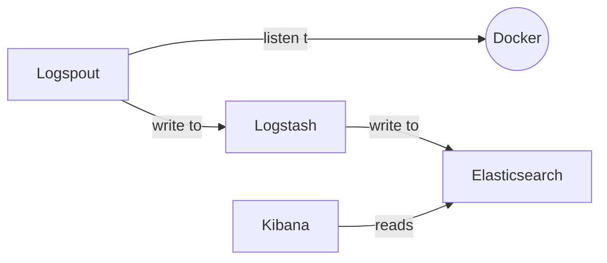

Run the demo with `docker-compose -f docker-compose-step3.yml up`

```bash
$ docker-compose -f docker-compose-step3.yml up
Starting grafana-monitoring-elastic-tick-kafka-ksql-c3-prometheus_example_1 ...
Starting grafana-monitoring-elastic-tick-kafka-ksql-c3-prometheus_example_1
Creating monitoring-demo_elasticsearch_1 ...
Creating monitoring-demo_elasticsearch_1 ... done
Recreating monitoring-demo_logstash_1 ...
Recreating monitoring-demo_logstash_1
Creating monitoring-demo_kibana_1 ...
Recreating monitoring-demo_logstash_1 ... done
Recreating monitoring-demo_logspout_1 ...
Recreating monitoring-demo_logspout_1 ... done
Attaching to grafana-monitoring-elastic-tick-kafka-ksql-c3-prometheus_example_1, monitoring-demo_elasticsearch_1, monitoring-demo_logstash_1, monitoring-demo_kibana_1, monitoring-demo_logspout_1
...
... snip snip ...
...
```

Now look at the logs in kibana

- open http://localhost:5601/
- click discover
- win !

## Getting these errors:

```
lasticsearch connection is working {:healthcheck_url=>http://elasticsearch:9200/, :path=>"/"}
logstash_1              | 21:49:14.760 [Ruby-0-Thread-5: /usr/share/logstash/vendor/bundle/jruby/1.9/gems/logstash-output-elasticsearch-7.4.3-java/lib/logstash/outputs/elasticsearch/http_client/pool.rb:228] WARN  logstash.outputs.elasticsearch - Attempted to resurrect connection to dead ES instance, but got an error. {:url=>"http://elasticsearch:9200/", :error_type=>LogStash::Outputs::ElasticSearch::HttpClient::Pool::HostUnreachableError, :error=>"Elasticsearch Unreachable: [http://elasticsearch:9200/][Manticore::SocketException] Connection refused (Connection refused)"}
elasticsearch_1         | [2022-07-28T21:49:16,143][INFO ][o.e.n.Node               ] initialized
elasticsearch_1         | [2022-07-28T21:49:16,144][INFO ][o.e.n.Node               ] [NvmQ9Fo] starting ...
kibana_1                | {"type":"log","@timestamp":"2022-07-28T21:49:16Z","tags":["warning","elasticsearch","admin"],"pid":1,"message":"Unable to revive connection: http://elasticsearch:9200/"}
kibana_1                | {"type":"log","@timestamp":"2022-07-28T21:49:16Z","tags":["warning","elasticsearch","admin"],"pid":1,"message":"No living connections"}
kibana_1                | {"type":"log","@timestamp":"2022-07-28T21:49:17Z","tags":["warning","elasticsearch","admin"],"pid":1,"message":"Unable to revive connection: http://elasticsearch:9200/"}
kibana_1                | {"type":"log","@timestamp":"2022-07-28T21:49:17Z","tags":["warning","elasticsearch","admin"],"pid":1,"message":"No living connections"}
elasticsearch_1         | [2022-07-28T21:49:17,079][INFO ][o.e.t.TransportService   ] [NvmQ9Fo] publish_address {192.168.224.2:9300}, bound_addresses {0.0.0.0:9300}
elasticsearch_1         | [2022-07-28T21:49:17,092][INFO ][o.e.b.BootstrapChecks    ] [NvmQ9Fo] bound or publishing to a non-loopback or non-link-local address, enforcing bootstrap checks
elasticsearch_1         | ERROR: [1] bootstrap checks failed
elasticsearch_1         | [1]: max virtual memory areas vm.max_map_count [65530] is too low, increase to at least [262144]
elasticsearch_1         | [2022-07-28T21:49:17,122][INFO ][o.e.n.Node               ] [NvmQ9Fo] stopping ...
elasticsearch_1         | [2022-07-28T21:49:17,235][INFO ][o.e.n.Node               ] [NvmQ9Fo] stopped
elasticsearch_1         | [2022-07-28T21:49:17,237][INFO ][o.e.n.Node               ] [NvmQ9Fo] closing ...
elasticsearch_1         | [2022-07-28T21:49:17,272][INFO ][o.e.n.Node               ] [NvmQ9Fo] closed
kibana_1                | {"type":"log","@timestamp":"2022-07-28T21:49:17Z","tags":["warning","elasticsearch","admin"],"pid":1,"message":"Unable to revive connection: http://elasticsearch:9200/"}
kibana_1                | {"type":"log","@timestamp":"2022-07-28T21:49:17Z","tags":["warning","elasticsearch","admin"],"pid":1,"message":"No living connections"}

and

logstash_1              | 21:49:29.788 [Ruby-0-Thread-5: /usr/share/logstash/vendor/bundle/jruby/1.9/gems/logstash-output-elasticsearch-7.4.3-java/lib/logstash/outputs/elasticsearch/http_client/pool.rb:228] INFO  logstash.outputs.elasticsearch - Running health check to see if an Elasticsearch connection is working {:healthcheck_url=>http://elasticsearch:9200/, :path=>"/"}
logstash_1              | 21:49:29.793 [Ruby-0-Thread-5: /usr/share/logstash/vendor/bundle/jruby/1.9/gems/logstash-output-elasticsearch-7.4.3-java/lib/logstash/outputs/elasticsearch/http_client/pool.rb:228] WARN  logstash.outputs.elasticsearch - Attempted to resurrect connection to dead ES instance, but got an error. {:url=>"http://elasticsearch:9200/", :error_type=>LogStash::Outputs::ElasticSearch::HttpClient::Pool::HostUnreachableError, :error=>"Elasticsearch Unreachable: [http://elasticsearch:9200/][Manticore::SocketException] Connection refused (Connection refused)"}
kibana_1                | {"type":"log","@timestamp":"2022-07-28T21:49:31Z","tags":["warning","elasticsearch","admin"],"pid":1,"message":"Unable to revive connection: http://elasticsearch:9200/"}
kibana_1                | {"type":"log","@timestamp":"2022-07-28T21:49:31Z","tags":["warning","elasticsearch","admin"],"pid":1,"message":"No living connections"}
kibana_1                | {"type":"log","@timestamp":"2022-07-28T21:49:32Z","tags":["warning","elasticsearch","admin"],"pid":1,"message":"Unable to revive connection: http://elasticsearch:9200/"}
kibana_1                | {"type":"log","@timestamp":"2022-07-28T21:49:32Z","tags":["warning","elasticsearch","admin"],"pid":1,"message":"No living connections"}
kibana_1                | {"type":"log","@timestamp":"2022-07-28T21:49:32Z","tags":["warning","elasticsearch","admin"],"pid":1,"message":"Unable to revive connection: http://elasticsearch:9200/"}
kibana_1                | {"type":"log","@timestamp":"2022-07-28T21:49:32Z","tags":["warning","elasticsearch","admin"],"pid":1,"message":"No living connections"}
elasticsearch_1         | [2022-07-28T21:49:34,148][INFO ][o.e.x.m.j.p.l.CppLogMessageHandler] [controller/48] [Main.cc@128] controller (64 bit): Version 5.6.0 (Build 93aea61f57f7d8) Copyright (c) 2017 Elasticsearch BV
elasticsearch_1         | [2022-07-28T21:49:34,272][INFO ][o.e.d.DiscoveryModule    ] [NvmQ9Fo] using discovery type [zen]
kibana_1                | {"type":"log","@timestamp":"2022-07-28T21:49:34Z","tags":["warning","elasticsearch","admin"],"pid":1,"message":"Unable to revive connection: http://elasticsearch:9200/"}
kibana_1                | {"type":"log","@timestamp":"2022-07-28T21:49:34Z","tags":["warning","elasticsearch","admin"],"pid":1,"message":"No living connections"}
```

# 5. Elasticsearch Metrics !

Docker has metrics about the state of each container, but also what is does consume, let's leverage that !

Let's use [metricbeat](https://www.elastic.co/guide/en/beats/metricbeat/current/index.html) for that

```yaml
metricbeat:
  image: docker.elastic.co/beats/metricbeat:5.6.3
  volumes:
    - /var/run/docker.sock:/tmp/docker.sock
  depends_on:
    - elasticsearch
```

_Note:_ like for logspout we need to ask container question to docker via its socket.

The nice thing about metric beat is that it comes with ready made dashboards, let's leverage that too.

```yaml
metricbeat-dashboard-setup:
  image: docker.elastic.co/beats/metricbeat:5.6.3
  command: ./scripts/import_dashboards -es http://elasticsearch:9200
  depends_on:
    - elasticsearch
```

Here are the containers at play :

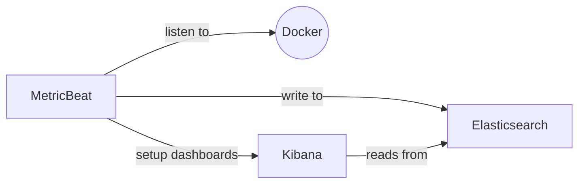

Run the demo with `docker-compose -f docker-compose-step4.yml up` then look at the

- [raw metrics](<http://localhost:5601/app/kibana#/discover?_g=()&_a=(columns:!(_source),index:'metricbeat-*',interval:auto,query:(match_all:()),sort:!('@timestamp',desc))>)
- [dashboards list](<http://localhost:5601/app/kibana#/dashboards?_g=()>)
- [system dashboard](<http://localhost:5601/app/kibana#/dashboard/Metricbeat-filesystem?_g=()&_a=(description:'',filters:!(),options:(darkTheme:!f),panels:!((col:1,id:System-Navigation,panelIndex:1,row:1,size_x:2,size_y:4,type:visualization),(col:1,id:Top-hosts-by-disk-size,panelIndex:5,row:10,size_x:12,size_y:4,type:visualization),(col:4,id:Disk-space-overview,panelIndex:6,row:1,size_x:9,size_y:4,type:visualization),(col:1,id:Free-disk-space-over-days,panelIndex:7,row:5,size_x:6,size_y:5,type:visualization),(col:7,id:Total-files-over-days,panelIndex:8,row:5,size_x:6,size_y:5,type:visualization)),query:(query_string:(analyze_wildcard:!t,query:'*')),timeRestore:!f,title:Metricbeat-filesystem,uiState:(P-5:(vis:(params:(sort:(columnIndex:!n,direction:!n))))),viewMode:view)>)

## Getting these Errors:

```
logstash_1                    | 22:03:38.806 [Ruby-0-Thread-5: /usr/share/logstash/vendor/bundle/jruby/1.9/gems/logstash-output-elasticsearch-7.4.3-java/lib/logstash/outputs/elasticsearch/http_client/pool.rb:228] INFO  logstash.outputs.elasticsearch - Running health check to see if an Elasticsearch connection is working {:healthcheck_url=>http://elasticsearch:9200/, :path=>"/"}
logstash_1                    | 22:03:38.817 [Ruby-0-Thread-5: /usr/share/logstash/vendor/bundle/jruby/1.9/gems/logstash-output-elasticsearch-7.4.3-java/lib/logstash/outputs/elasticsearch/http_client/pool.rb:228] WARN  logstash.outputs.elasticsearch - Attempted to resurrect connection to dead ES instance, but got an error. {:url=>"http://elasticsearch:9200/", :error_type=>LogStash::Outputs::ElasticSearch::HttpClient::Pool::HostUnreachableError, :error=>"Elasticsearch Unreachable: [http://elasticsearch:9200/][Manticore::SocketException] Connection refused (Connection refused)"}
metricbeat_1                  | 2022/07/28 22:03:39.500005 metrics.go:39: INFO Non-zero metrics in the last 30s: fetches.system-cpu.events=3 fetches.system-cpu.success=3 fetches.system-filesystem.events=2 fetches.system-filesystem.success=1 fetches.system-fsstat.events=1 fetches.system-fsstat.success=1 fetches.system-load.events=3 fetches.system-load.success=3 fetches.system-memory.events=3 fetches.system-memory.success=3 fetches.system-network.events=6 fetches.system-network.success=3 fetches.system-process.events=3 fetches.system-process.success=3 fetches.system-socket.success=60 libbeat.outputs.messages_dropped=1 libbeat.publisher.messages_in_worker_queues=21 libbeat.publisher.published_events=21
kibana_1                      | {"type":"log","@timestamp":"2022-07-28T22:03:40Z","tags":["warning","elasticsearch","admin"],"pid":1,"message":"Unable to revive connection: http://elasticsearch:9200/"}

and

kibana_1                      | {"type":"log","@timestamp":"2022-07-28T22:03:43Z","tags":["warning","elasticsearch","admin"],"pid":1,"message":"Unable to revive connection: http://elasticsearch:9200/"}
kibana_1                      | {"type":"log","@timestamp":"2022-07-28T22:03:43Z","tags":["warning","elasticsearch","admin"],"pid":1,"message":"No living connections"}
^CGracefully stopping... (press Ctrl+C again to force)
Stopping grafana-monitoring-elastic-tick-kafka-ksql-c3-prometheus_metricbeat_1                 ... done
Stopping grafana-monitoring-elastic-tick-kafka-ksql-c3-prometheus_logspout_1                   ... done
Stopping grafana-monitoring-elastic-tick-kafka-ksql-c3-prometheus_logstash_1                   ...
Stopping grafana-monitoring-elastic-tick-kafka-ksql-c3-prometheus_kibana_1                     ...
Stopping grafana-monitoring-elastic-tick-kafka-ksql-c3-prometheus_elasticsearch_1              ...
Stopping cdf6d2559676_grafana-monitoring-elastic-tick-kafka-ksql-c3-prometheus_example_1       ... done
Killing grafana-monitoring-elastic-tick-kafka-ksql-c3-prometheus_logstash_1                    ... done
Killing grafana-monitoring-elastic-tick-kafka-ksql-c3-prometheus_kibana_1                      ... error
Killing grafana-monitoring-elastic-tick-kafka-ksql-c3-prometheus_elasticsearch_1               ... done
```

# 6. Better metrics: the TICK stack

The [TICK](https://www.influxdata.com/time-series-platform/) stack is comprised of

- [Telegraf](https://www.influxdata.com/time-series-platform/telegraf/) a component that gathers metrics, such as [collectd](https://collectd.org/)
- [Influxdb](https://www.influxdata.com/time-series-platform/influxdb/) a timeseries database
- [Chronograf](https://www.influxdata.com/time-series-platform/chronograf/) a visualization tool
- [Kapacitor](https://www.influxdata.com/time-series-platform/kapacitor/) real time alerting platform

This stack has many very interesting properties, let's leverage them.

Let's start with `influxdb`

```yaml
influxdb:
  image: influxdb:1.3.7
  ports:
    - "8086:8086"
```

Then kapacitor

```yaml
kapacitor:
  image: kapacitor:1.3.3
  hostname: kapacitor
  environment:
    KAPACITOR_HOSTNAME: kapacitor
    KAPACITOR_INFLUXDB_0_URLS_0: http://influxdb:8086
  depends_on:
    - influxdb
```

Then chronograf

```yaml
chronograf:
  image: chronograf:1.3.10
  environment:
    KAPACITOR_URL: http://kapacitor:9092
    INFLUXDB_URL: http://influxdb:8086
  ports:
    - "8888:8888"
  depends_on:
    - influxdb
    - kapacitor
```

Then `telegraf`

```yaml
telegraf:
  image: telegraf:1.4.3
  volumes:
    - /var/run/docker.sock:/tmp/docker.sock
    - ./telegraf/telegraf.conf:/etc/telegraf/telegraf.conf:ro
  links:
    - influxdb
    - elasticsearch
```

A few things to notice here:

- we once again match docker.sock : we will listen to metrics in telegraf too
- we have a local telegraf.conf
- we link to influxdb as metrics will be shipped there
- we link elasticsearch ... we will monitor elasticsearch too !

Let's look at how telegraf conf looks like.

I removed many default values, if you want to see them fully go to https://github.com/influxdata/telegraf/blob/master/etc/telegraf.conf

```ini
[agent]
interval = "10s"

## Outputs
[[outputs.influxdb]]
urls = ["http://influxdb:8086"]
database = "telegraf"

## Inputs
[[inputs.cpu]]
[[inputs.disk]]
[[inputs.diskio]]
[[inputs.kernel]]
[[inputs.mem]]
[[inputs.processes]]
[[inputs.swap]]
[[inputs.system]]
[[inputs.net]]
[[inputs.netstat]]
[[inputs.interrupts]]
[[inputs.linux_sysctl_fs]]
[[inputs.docker]]
endpoint = "unix:///tmp/docker.sock"
[[inputs.elasticsearch]]
servers = ["http://elasticsearch:9200"]
```

This configuration should be self-explanatory right ?

**Note:** The telegraf plugin ecosystem is huge, see the full list here : https://github.com/influxdata/telegraf#input-plugins

Now run the demo `docker-compose -f docker-compose-step5.yml up`

You are starting to have many containers:

The ELK story:

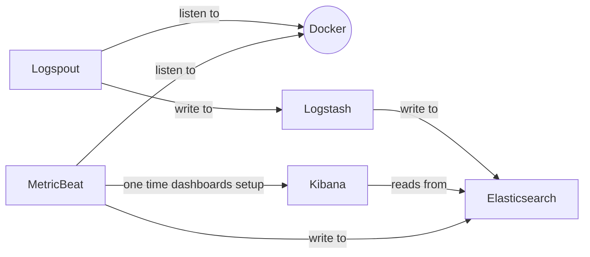

And the TICK story:

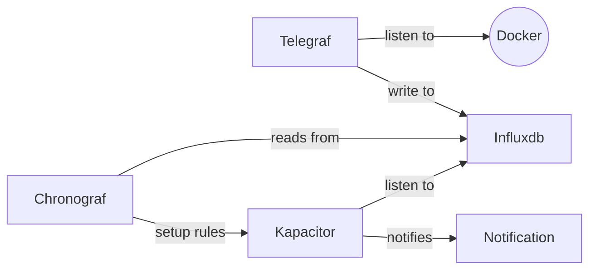

Run the demo with `docker-compose -f docker-compose-step5.yml up` then look at the following links

- [chronograf data explorer](http://localhost:8888/sources/0/chronograf/data-explorer)
- [a query sample](http://localhost:8888/sources/0/chronograf/data-explorer?query=SELECT%20mean%28%22io_service_bytes_recursive_sync%22%29%20AS%20%22mean_io_service_bytes_recursive_sync%22%20FROM%20%22telegraf%22.%22autogen%22.%22docker_container_blkio%22%20WHERE%20time%20%3E%20now%28%29%20-%201h%20GROUP%20BY%20time%2810s%29%20FILL%28null%29)
- [create an alert](http://localhost:8888/sources/0/alert-rules/new)

You can play around with the alerting system etc.

## Getting these Errors:

```
grafana-monitoring-elastic-tick-kafka-ksql-c3-prometheus_elasticsearch_1 exited with code 78
kibana_1                      | {"type":"log","@timestamp":"2022-07-29T04:07:33Z","tags":["warning","elasticsearch","admin"],"pid":1,"message":"Unable to revive connection: http://elasticsearch:9200/"}
kibana_1                      | {"type":"log","@timestamp":"2022-07-29T04:07:33Z","tags":["warning","elasticsearch","admin"],"pid":1,"message":"No living connections"}
kibana_1                      | {"type":"log","@timestamp":"2022-07-29T04:07:33Z","tags":["warning","elasticsearch","admin"],"pid":1,"message":"Unable to revive connection: http://elasticsearch:9200/"}
kibana_1                      | {"type":"log","@timestamp":"2022-07-29T04:07:33Z","tags":["warning","elasticsearch","admin"],"pid":1,"message":"No living connections"}
kibana_1                      | {"type":"log","@timestamp":"2022-07-29T04:07:33Z","tags":["warning","elasticsearch","admin"],"pid":1,"message":"Unable to revive connection: http://elasticsearch:9200/"}
kibana_1                      | {"type":"log","@timestamp":"2022-07-29T04:07:33Z","tags":["warning","elasticsearch","admin"],"pid":1,"message":"No living connections"}
logstash_1                    | 04:07:33.985 [Ruby-0-Thread-5: /usr/share/logstash/vendor/bundle/jruby/1.9/gems/logstash-output-elasticsearch-7.4.3-java/lib/logstash/outputs/elasticsearch/http_client/pool.rb:228] INFO  logstash.outputs.elasticsearch - Running health check to see if an Elasticsearch connection is working {:healthcheck_url=>http://elasticsearch:9200/, :path=>"/"}
logstash_1                    | 04:07:33.990 [Ruby-0-Thread-5: /usr/share/logstash/vendor/bundle/jruby/1.9/gems/logstash-output-elasticsearch-7.4.3-java/lib/logstash/outputs/elasticsearch/http_client/pool.rb:228] WARN  logstash.outputs.elasticsearch - Attempted to resurrect connection to dead ES instance, but got an error. {:url=>"http://elasticsearch:9200/", :error_type=>LogStash::Outputs::ElasticSearch::HttpClient::Pool::HostUnreachableError, :error=>"Elasticsearch Unreachable: [http://elasticsearch:9200/][Manticore::SocketException] Connection refused (Connection refused)"}
kibana_1                      | {"type":"log","@timestamp":"2022-07-29T04:07:35Z","tags":["warning","elasticsearch","admin"],"pid":1,"message":"Unable to revive connection: http://elasticsearch:9200/"}
kibana_1                      | {"type":"log","@timestamp":"2022-07-29T04:07:35Z","tags":["warning","elasticsearch","admin"],"pid":1,"message":"No living connections"}
kibana_1                      | {"type":"log","@timestamp":"2022-07-29T04:07:36Z","tags":["warning","elasticsearch","admin"],"pid":1,"message":"Unable to revive connection: http://elasticsearch:9200/"}
kibana_1                      | {"type":"log","@timestamp":"2022-07-29T04:07:36Z","tags":["warning","elasticsearch","admin"],"pid":1,"message":"No living connections"}
kibana_1                      | {"type":"log","@timestamp":"2022-07-29T04:07:36Z","tags":["warning","elasticsearch","admin"],"pid":1,"message":"Unable to revive connection: http://elasticsearch:9200/"}
kibana_1                      | {"type":"log","@timestamp":"2022-07-29T04:07:36Z","tags":["warning","elasticsearch","admin"],"pid":1,"message":"No living connections"}
elasticsearch_1               | [2022-07-29T04:07:36,973][INFO ][o.e.n.Node               ] [] initializing ...
elasticsearch_1               | [2022-07-29T04:07:37,167][INFO ][o.e.e.NodeEnvironment    ] [NvmQ9Fo] using [1] data paths, mounts [[/ (overlay)]], net usable_space [32.8gb], net total_space [77.3gb], spins? [possibly], types [overlay]
elasticsearch_1               | [2022-07-29T04:07:37,169][INFO ][o.e.e.NodeEnvironment    ] [NvmQ9Fo] heap size [1.9gb], compressed ordinary object pointers [true]
elasticsearch_1               | [2022-07-29T04:07:37,179][INFO ][o.e.n.Node               ] node name [NvmQ9Fo] derived from node ID [NvmQ9FoMQ8yrvoXl5PdI_Q]; set [node.name] to override
elasticsearch_1               | [2022-07-29T04:07:37,181][INFO ][o.e.n.Node               ] version[5.6.0], pid[1], build[781a835/2017-09-07T03:09:58.087Z], OS[Linux/5.4.0-122-generic/amd64], JVM[Oracle Corporation/OpenJDK 64-Bit Server VM/1.8.0_141/25.141-b16]
elasticsearch_1               | [2022-07-29T04:07:37,181][INFO ][o.e.n.Node               ] JVM arguments [-Xms2g, -Xmx2g, -XX:+UseConcMarkSweepGC, -XX:CMSInitiatingOccupancyFraction=75, -XX:+UseCMSInitiatingOccupancyOnly, -XX:+AlwaysPreTouch, -Xss1m, -Djava.awt.headless=true, -Dfile.encoding=UTF-8, -Djna.nosys=true, -Djdk.io.permissionsUseCanonicalPath=true, -Dio.netty.noUnsafe=true, -Dio.netty.noKeySetOptimization=true, -Dio.netty.recycler.maxCapacityPerThread=0, -Dlog4j.shutdownHookEnabled=false, -Dlog4j2.disable.jmx=true, -Dlog4j.skipJansi=true, -XX:+HeapDumpOnOutOfMemoryError, -Des.cgroups.hierarchy.override=/, -Des.path.home=/usr/share/elasticsearch]
kibana_1                      | {"type":"log","@timestamp":"2022-07-29T04:07:38Z","tags":["warning","elasticsearch","admin"],"pid":1,"message":"Unable to revive connection: http://elasticsearch:9200/"}
kibana_1                      | {"type":"log","@timestamp":"2022-07-29T04:07:38Z","tags":["warning","elasticsearch","admin"],"pid":1,"message":"No living connections"}
^CGracefully stopping... (press Ctrl+C again to force)
Stopping grafana-monitoring-elastic-tick-kafka-ksql-c3-prometheus_chronograf_1                 ... done
Stopping grafana-monitoring-elastic-tick-kafka-ksql-c3-prometheus_telegraf_1                   ... done
Stopping grafana-monitoring-elastic-tick-kafka-ksql-c3-prometheus_kapacitor_1                  ... done
Stopping grafana-monitoring-elastic-tick-kafka-ksql-c3-prometheus_influxdb_1                   ... done
Stopping grafana-monitoring-elastic-tick-kafka-ksql-c3-prometheus_metricbeat_1                 ... done
Stopping grafana-monitoring-elastic-tick-kafka-ksql-c3-prometheus_logspout_1                   ... done
Stopping grafana-monitoring-elastic-tick-kafka-ksql-c3-prometheus_logstash_1                   ... done
Stopping grafana-monitoring-elastic-tick-kafka-ksql-c3-prometheus_kibana_1                     ... done
Stopping grafana-monitoring-elastic-tick-kafka-ksql-c3-prometheus_elasticsearch_1              ... done
Stopping cdf6d2559676_grafana-monitoring-elastic-tick-kafka-ksql-c3-prometheus_example_1       ... done
```

# 7. Getting the best of the ecosystem

Are are now in a pretty good shape

1. we have all the logs in elasticseach
1. we have metrics in elasticsearch
1. we have metrics in influxdb
1. we have a mean of visualization via chronograf
1. we have a mean of alerting via kapacitor

We should be all set right ?

Well, no, we can do better: as an admin I want to mix and match logs, visualization and alerting in a single page.

Let's do that together by leveraging [grafana](https://grafana.com)

```yaml
grafana:
  image: grafana/grafana:4.6.1
  ports:
    - "3000:3000"
  depends_on:
    - influxdb
    - elasticsearch
```

Nothing fancy here, but if you run like this, you'll have to setup manually

- the elasticsearch datasource
- the influxdb datasource
- the alert channels
- having a few default dashboards

Well there's a local build that does just that

```yaml
grafana-setup:
  build: grafana-setup/
  depends_on:
    - grafana
```

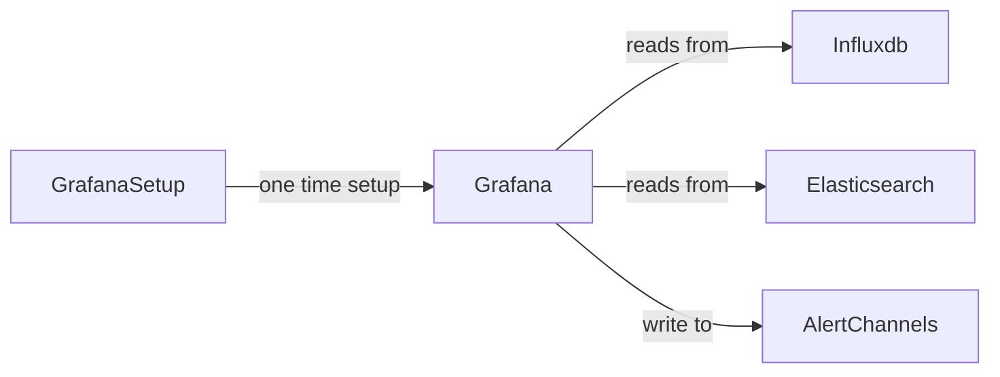

Run the demo with `docker-compose -f docker-compose-step6.yml up` then enjoy your [docker metrics](http://localhost:3000/dashboard/db/docker?refresh=5s&orgId=1&from=now-5m&to=now) in grafan!

**Note:** Use username `admin` password `admin`

Go at the bottom of the page ... here are the logs for the container you are looking at !

**Note:** do not hesitate to rely on dashboards from the community at https://grafana.com/dashboards

You can create alerts etc. That's great.

## Getting these Errors:

```
chronograf_1                  | time="2022-07-29T04:20:18Z" level=info msg=Request component=server method=GET remote_addr="192.168.224.1:36480" url=/chronograf/v1/me
chronograf_1                  | time="2022-07-29T04:20:18Z" level=info msg="Response: OK" code=200 component=server remote_addr="192.168.224.1:36480" response_time="141.286µs"
telegraf_1                    | 2022-07-29T04:20:20Z E! Error in plugin [inputs.elasticsearch]: Get http://elasticsearch:9200/_nodes/stats: dial tcp 192.168.224.2:9200: getsockopt: connection refused
kapacitor_1                   | [httpd] 192.168.224.3 - - [29/Jul/2022:04:20:20 +0000] "POST /write?consistency=&db=_internal&precision=ns&rp=monitor HTTP/1.1" 204 0 "-" "InfluxDBClient" c1d46b6e-0ef5-11ed-8029-000000000000 455
kapacitor_1                   | [httpd] 192.168.224.3 - - [29/Jul/2022:04:20:20 +0000] "POST /write?consistency=&db=telegraf&precision=ns&rp=autogen HTTP/1.1" 204 0 "-" "InfluxDBClient" c2121b37-0ef5-11ed-802a-000000000000 11517
influxdb_1                    | [httpd] 192.168.224.10 - - [29/Jul/2022:04:20:20 +0000] "POST /write?db=telegraf HTTP/1.1" 204 0 "-" "-" c201d543-0ef5-11ed-8036-000000000000 128805
kibana_1                      | {"type":"log","@timestamp":"2022-07-29T04:20:21Z","tags":["warning","elasticsearch","admin"],"pid":1,"message":"Unable to revive connection: http://elasticsearch:9200/"}
kibana_1                      | {"type":"log","@timestamp":"2022-07-29T04:20:21Z","tags":["warning","elasticsearch","admin"],"pid":1,"message":"No living connections"}
kibana_1                      | {"type":"log","@timestamp":"2022-07-29T04:20:21Z","tags":["warning","elasticsearch","admin"],"pid":1,"message":"Unable to revive connection: http://elasticsearch:9200/"}
kibana_1                      | {"type":"log","@timestamp":"2022-07-29T04:20:21Z","tags":["warning","elasticsearch","admin"],"pid":1,"message":"No living connections"}
kibana_1                      | {"type":"log","@timestamp":"2022-07-29T04:20:21Z","tags":["warning","elasticsearch","admin"],"pid":1,"message":"Unable to revive connection: http://elasticsearch:9200/"}
kibana_1                      | {"type":"log","@timestamp":"2022-07-29T04:20:21Z","tags":["warning","elasticsearch","admin"],"pid":1,"message":"No living connections"}
elasticsearch_1               | [2022-07-29T04:20:22,159][INFO ][o.e.n.Node               ] [] initializing ...
elasticsearch_1               | [2022-07-29T04:20:22,552][INFO ][o.e.e.NodeEnvironment    ] [NvmQ9Fo] using [1] data paths, mounts [[/ (overlay)]], net usable_space [32.5gb], net total_space [77.3gb], spins? [possibly], types [overlay]
elasticsearch_1               | [2022-07-29T04:20:22,556][INFO ][o.e.e.NodeEnvironment    ] [NvmQ9Fo] heap size [1.9gb], compressed ordinary object pointers [true]
elasticsearch_1               | [2022-07-29T04:20:22,565][INFO ][o.e.n.Node               ] node name [NvmQ9Fo] derived from node ID [NvmQ9FoMQ8yrvoXl5PdI_Q]; set [node.name] to override
elasticsearch_1               | [2022-07-29T04:20:22,566][INFO ][o.e.n.Node               ] version[5.6.0], pid[1], build[781a835/2017-09-07T03:09:58.087Z], OS[Linux/5.4.0-122-generic/amd64], JVM[Oracle Corporation/OpenJDK 64-Bit Server VM/1.8.0_141/25.141-b16]
elasticsearch_1               | [2022-07-29T04:20:22,569][INFO ][o.e.n.Node               ] JVM arguments [-Xms2g, -Xmx2g, -XX:+UseConcMarkSweepGC, -XX:CMSInitiatingOccupancyFraction=75, -XX:+UseCMSInitiatingOccupancyOnly, -XX:+AlwaysPreTouch, -Xss1m, -Djava.awt.headless=true, -Dfile.encoding=UTF-8, -Djna.nosys=true, -Djdk.io.permissionsUseCanonicalPath=true, -Dio.netty.noUnsafe=true, -Dio.netty.noKeySetOptimization=true, -Dio.netty.recycler.maxCapacityPerThread=0, -Dlog4j.shutdownHookEnabled=false, -Dlog4j2.disable.jmx=true, -Dlog4j.skipJansi=true, -XX:+HeapDumpOnOutOfMemoryError, -Des.cgroups.hierarchy.override=/, -Des.path.home=/usr/share/elasticsearch]
logstash_1                    | 04:20:23.455 [Ruby-0-Thread-5: /usr/share/logstash/vendor/bundle/jruby/1.9/gems/logstash-output-elasticsearch-7.4.3-java/lib/logstash/outputs/elasticsearch/http_client/pool.rb:228] INFO  logstash.outputs.elasticsearch - Running health check to see if an Elasticsearch connection is working {:healthcheck_url=>http://elasticsearch:9200/, :path=>"/"}
logstash_1                    | 04:20:23.460 [Ruby-0-Thread-5: /usr/share/logstash/vendor/bundle/jruby/1.9/gems/logstash-output-elasticsearch-7.4.3-java/lib/logstash/outputs/elasticsearch/http_client/pool.rb:228] WARN  logstash.outputs.elasticsearch - Attempted to resurrect connection to dead ES instance, but got an error. {:url=>"http://elasticsearch:9200/", :error_type=>LogStash::Outputs::ElasticSearch::HttpClient::Pool::HostUnreachableError, :error=>"Elasticsearch Unreachable: [http://elasticsearch:9200/][Manticore::SocketException] Connection refused (Connection refused)"}
kibana_1                      | {"type":"log","@timestamp":"2022-07-29T04:20:23Z","tags":["warning","elasticsearch","admin"],"pid":1,"message":"Unable to revive connection: http://elasticsearch:9200/"}
kibana_1                      | {"type":"log","@timestamp":"2022-07-29T04:20:23Z","tags":["warning","elasticsearch","admin"],"pid":1,"message":"No living connections"}
kibana_1                      | {"type":"log","@timestamp":"2022-07-29T04:20:23Z","tags":["warning","elasticsearch","admin"],"pid":1,"message":"Unable to revive connection: http://elasticsearch:9200/"}
kibana_1                      | {"type":"log","@timestamp":"2022-07-29T04:20:23Z","tags":["warning","elasticsearch","admin"],"pid":1,"message":"No living connections"}
kibana_1                      | {"type":"log","@timestamp":"2022-07-29T04:20:24Z","tags":["warning","elasticsearch","admin"],"pid":1,"message":"Unable to revive connection: http://elasticsearch:9200/"}
kibana_1                      | {"type":"log","@timestamp":"2022-07-29T04:20:24Z","tags":["warning","elasticsearch","admin"],"pid":1,"message":"No living connections"}
^CGracefully stopping... (press Ctrl+C again to force)
Stopping grafana-monitoring-elastic-tick-kafka-ksql-c3-prometheus_grafana_1                    ... done
Stopping grafana-monitoring-elastic-tick-kafka-ksql-c3-prometheus_chronograf_1                 ... done
Stopping grafana-monitoring-elastic-tick-kafka-ksql-c3-prometheus_telegraf_1                   ... done
Stopping grafana-monitoring-elastic-tick-kafka-ksql-c3-prometheus_kapacitor_1                  ... done
Stopping grafana-monitoring-elastic-tick-kafka-ksql-c3-prometheus_influxdb_1                   ... done
Stopping grafana-monitoring-elastic-tick-kafka-ksql-c3-prometheus_metricbeat_1                 ... done
Stopping grafana-monitoring-elastic-tick-kafka-ksql-c3-prometheus_logspout_1                   ... done
Stopping grafana-monitoring-elastic-tick-kafka-ksql-c3-prometheus_logstash_1                   ... done
Stopping grafana-monitoring-elastic-tick-kafka-ksql-c3-prometheus_kibana_1                     ... done
Stopping grafana-monitoring-elastic-tick-kafka-ksql-c3-prometheus_elasticsearch_1              ... done
Stopping cdf6d2559676_grafana-monitoring-elastic-tick-kafka-ksql-c3-prometheus_example_1       ... done
```

# 8. Kafka the data hub

We can't have all this data for ourselves right ? We most probably are not the same users.

What about the security team, what about auditing, what about performance engineers, what about pushing the data to other storages etc.

Well [kafka](https://kafka.apache.org/) is very useful here, let's leverage that component.

Kafka relies on zookeeper, let's use the simplest images I could find:

```yaml
zookeeper:
  image: wurstmeister/zookeeper:3.4.6
  ports:
    - "2181:2181"
```

Same for thing for kafka

```yaml
kafka:
  image: wurstmeister/kafka:1.0.0
  ports:
    - "9092"
  environment:
    KAFKA_ZOOKEEPER_CONNECT: zookeeper:2181
  depends_on:
    - zookeeper
```

Now we can update telegraf to ask to ship all its data to kafka too.

Let's add the kafka output in the telegraf configuration

```ini
[[outputs.kafka]]
   brokers = ["kafka:9092"]
   topic = "telegraf"
```

And add the link to telegraf container to kafka server

```yaml
telegraf:
  image: telegraf:1.4.3
  volumes:
    - /var/run/docker.sock:/tmp/docker.sock
    - ./telegraf/telegraf-with-kafka-output.conf:/etc/telegraf/telegraf.conf:ro
  links:
    - influxdb
    - elasticsearch
    - kafka
```

The Kafka story

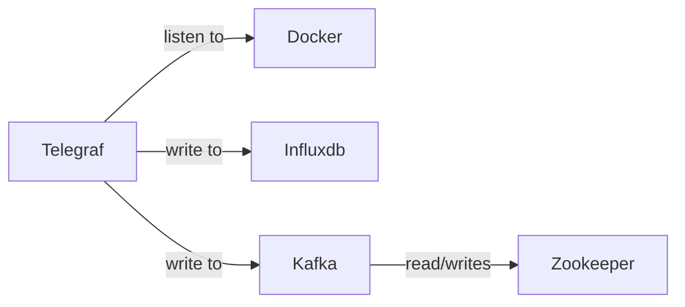

Run the demo `docker-compose -f docker-compose-step7.yml up`

Let's see if we got our metrics data readily available in kafka ...

```bash
docker exec -ti monitoring-demo_kafka_1 kafka-console-consumer.sh  --zookeeper zookeeper --topic telegraf --max-messages 5
Using the ConsoleConsumer with old consumer is deprecated and will be removed in a future major release. Consider using the new consumer by passing [bootstrap-server] instead of [zookeeper].
docker_container_mem,build-date=20170801,com.docker.compose.service=kibana,license=GPLv2,com.docker.compose.config-hash=1e1f2bf92f25fcc3a4b235d04f600cd276809e7195a0c5196f0a8098e82e47b3,host=c280c5e69493,container_image=docker.elastic.co/kibana/kibana,maintainer=Elastic\ Docker\ Team\ <docker@elastic.co>,com.docker.compose.version=1.16.1,com.docker.compose.oneoff=False,com.docker.compose.project=monitoring-demo,vendor=CentOS,com.docker.compose.container-number=1,name=CentOS\ Base\ Image,engine_host=moby,container_name=monitoring-demo_kibana_1,container_version=5.5.2 pgpgin=98309i,rss_huge=0i,total_pgmajfault=3i,total_pgpgin=98309i,total_rss_huge=0i,usage_percent=1.9058546412278363,active_anon=155103232i,hierarchical_memory_limit=9223372036854771712i,max_usage=272527360i,container_id="aa2195088fd305079d2942b009c9e9fd1bb38781aa558be6a9f084a334b1b755",writeback=0i,pgfault=116807i,pgpgout=59702i,total_mapped_file=0i,total_unevictable=0i,total_writeback=0i,unevictable=0i,active_file=0i,mapped_file=0i,total_inactive_anon=20480i,total_pgfault=116807i,total_rss=154718208i,usage=162758656i,total_active_anon=155103232i,cache=3416064i,rss=154718208i,total_cache=3416064i,total_inactive_file=3010560i,total_pgpgout=59702i,limit=8360689664i,pgmajfault=3i,total_active_file=0i,inactive_anon=20480i,inactive_file=3010560i 1508887282000000000

docker_container_cpu,vendor=CentOS,com.docker.compose.container-number=1,build-date=20170801,container_image=docker.elastic.co/kibana/kibana,com.docker.compose.project=monitoring-demo,container_name=monitoring-demo_kibana_1,cpu=cpu-total,host=c280c5e69493,license=GPLv2,com.docker.compose.config-hash=1e1f2bf92f25fcc3a4b235d04f600cd276809e7195a0c5196f0a8098e82e47b3,com.docker.compose.oneoff=False,engine_host=moby,container_version=5.5.2,com.docker.compose.service=kibana,maintainer=Elastic\ Docker\ Team\ <docker@elastic.co>,com.docker.compose.version=1.16.1,name=CentOS\ Base\ Image usage_total=11394168870i,usage_system=27880670000000i,throttling_periods=0i,throttling_throttled_periods=0i,throttling_throttled_time=0i,usage_in_usermode=10420000000i,usage_in_kernelmode=970000000i,container_id="aa2195088fd305079d2942b009c9e9fd1bb38781aa558be6a9f084a334b1b755",usage_percent=7.948400539083559 1508887282000000000

docker_container_cpu,com.docker.compose.project=monitoring-demo,vendor=CentOS,com.docker.compose.container-number=1,com.docker.compose.oneoff=False,container_image=docker.elastic.co/kibana/kibana,maintainer=Elastic\ Docker\ Team\ <docker@elastic.co>,engine_host=moby,com.docker.compose.config-hash=1e1f2bf92f25fcc3a4b235d04f600cd276809e7195a0c5196f0a8098e82e47b3,build-date=20170801,license=GPLv2,com.docker.compose.version=1.16.1,container_name=monitoring-demo_kibana_1,host=c280c5e69493,name=CentOS\ Base\ Image,cpu=cpu0,container_version=5.5.2,com.docker.compose.service=kibana container_id="aa2195088fd305079d2942b009c9e9fd1bb38781aa558be6a9f084a334b1b755",usage_total=3980860071i 1508887282000000000

docker_container_cpu,com.docker.compose.container-number=1,host=c280c5e69493,name=CentOS\ Base\ Image,com.docker.compose.oneoff=False,container_version=5.5.2,build-date=20170801,com.docker.compose.service=kibana,maintainer=Elastic\ Docker\ Team\ <docker@elastic.co>,vendor=CentOS,com.docker.compose.project=monitoring-demo,engine_host=moby,license=GPLv2,com.docker.compose.config-hash=1e1f2bf92f25fcc3a4b235d04f600cd276809e7195a0c5196f0a8098e82e47b3,com.docker.compose.version=1.16.1,container_name=monitoring-demo_kibana_1,container_image=docker.elastic.co/kibana/kibana,cpu=cpu1 usage_total=3942753596i,container_id="aa2195088fd305079d2942b009c9e9fd1bb38781aa558be6a9f084a334b1b755" 1508887282000000000

docker_container_cpu,maintainer=Elastic\ Docker\ Team\ <docker@elastic.co>,cpu=cpu2,host=c280c5e69493,build-date=20170801,container_version=5.5.2,com.docker.compose.config-hash=1e1f2bf92f25fcc3a4b235d04f600cd276809e7195a0c5196f0a8098e82e47b3,com.docker.compose.version=1.16.1,com.docker.compose.container-number=1,name=CentOS\ Base\ Image,com.docker.compose.oneoff=False,container_name=monitoring-demo_kibana_1,com.docker.compose.service=kibana,container_image=docker.elastic.co/kibana/kibana,vendor=CentOS,com.docker.compose.project=monitoring-demo,engine_host=moby,license=GPLv2 usage_total=1607029783i,container_id="aa2195088fd305079d2942b009c9e9fd1bb38781aa558be6a9f084a334b1b755" 1508887282000000000

Processed a total of 5 messages
```

Yes it looks like it !

We are in a pretty good shape right ?

Well, we can do better. We have many jvm based components such as kafka, and we know its monitoring is based on the JMX standard.

## Getting these Errors:

```
metricbeat_1                  | 2022/07/29 04:29:53.366511 metrics.go:39: INFO Non-zero metrics in the last 30s: fetches.system-cpu.events=3 fetches.system-cpu.success=3 fetches.system-filesystem.events=2 fetches.system-filesystem.success=1 fetches.system-fsstat.events=1 fetches.system-fsstat.success=1 fetches.system-load.events=3 fetches.system-load.success=3 fetches.system-memory.events=3 fetches.system-memory.success=3 fetches.system-network.events=6 fetches.system-network.success=3 fetches.system-process.events=3 fetches.system-process.success=3 fetches.system-socket.success=60 libbeat.publisher.messages_in_worker_queues=21 libbeat.publisher.published_events=21
elasticsearch_1               | [2022-07-29T04:29:53,749][INFO ][o.e.x.m.j.p.l.CppLogMessageHandler] [controller/50] [Main.cc@128] controller (64 bit): Version 5.6.0 (Build 93aea61f57f7d8) Copyright (c) 2017 Elasticsearch BV
elasticsearch_1               | [2022-07-29T04:29:53,903][INFO ][o.e.d.DiscoveryModule    ] [NvmQ9Fo] using discovery type [zen]
kibana_1                      | {"type":"log","@timestamp":"2022-07-29T04:29:54Z","tags":["warning","elasticsearch","admin"],"pid":1,"message":"Unable to revive connection: http://elasticsearch:9200/"}
kibana_1                      | {"type":"log","@timestamp":"2022-07-29T04:29:54Z","tags":["warning","elasticsearch","admin"],"pid":1,"message":"No living connections"}
kibana_1                      | {"type":"log","@timestamp":"2022-07-29T04:29:54Z","tags":["warning","elasticsearch","admin"],"pid":1,"message":"Unable to revive connection: http://elasticsearch:9200/"}
kibana_1                      | {"type":"log","@timestamp":"2022-07-29T04:29:54Z","tags":["warning","elasticsearch","admin"],"pid":1,"message":"No living connections"}
kibana_1                      | {"type":"log","@timestamp":"2022-07-29T04:29:54Z","tags":["warning","elasticsearch","admin"],"pid":1,"message":"Unable to revive connection: http://elasticsearch:9200/"}
kibana_1                      | {"type":"log","@timestamp":"2022-07-29T04:29:54Z","tags":["warning","elasticsearch","admin"],"pid":1,"message":"No living connections"}
logstash_1                    | 04:29:54.351 [Ruby-0-Thread-5: /usr/share/logstash/vendor/bundle/jruby/1.9/gems/logstash-output-elasticsearch-7.4.3-java/lib/logstash/outputs/elasticsearch/http_client/pool.rb:228] INFO  logstash.outputs.elasticsearch - Running health check to see if an Elasticsearch connection is working {:healthcheck_url=>http://elasticsearch:9200/, :path=>"/"}
logstash_1                    | 04:29:54.355 [Ruby-0-Thread-5: /usr/share/logstash/vendor/bundle/jruby/1.9/gems/logstash-output-elasticsearch-7.4.3-java/lib/logstash/outputs/elasticsearch/http_client/pool.rb:228] WARN  logstash.outputs.elasticsearch - Attempted to resurrect connection to dead ES instance, but got an error. {:url=>"http://elasticsearch:9200/", :error_type=>LogStash::Outputs::ElasticSearch::HttpClient::Pool::HostUnreachableError, :error=>"Elasticsearch Unreachable: [http://elasticsearch:9200/][Manticore::SocketException] Connection refused (Connection refused)"}
kibana_1                      | {"type":"log","@timestamp":"2022-07-29T04:29:56Z","tags":["warning","elasticsearch","admin"],"pid":1,"message":"Unable to revive connection: http://elasticsearch:9200/"}
kibana_1                      | {"type":"log","@timestamp":"2022-07-29T04:29:56Z","tags":["warning","elasticsearch","admin"],"pid":1,"message":"No living connections"}
kibana_1                      | {"type":"log","@timestamp":"2022-07-29T04:29:56Z","tags":["warning","elasticsearch","admin"],"pid":1,"message":"Unable to revive connection: http://elasticsearch:9200/"}
kibana_1                      | {"type":"log","@timestamp":"2022-07-29T04:29:56Z","tags":["warning","elasticsearch","admin"],"pid":1,"message":"No living connections"}
kibana_1                      | {"type":"log","@timestamp":"2022-07-29T04:29:57Z","tags":["warning","elasticsearch","admin"],"pid":1,"message":"Unable to revive connection: http://elasticsearch:9200/"}
kibana_1                      | {"type":"log","@timestamp":"2022-07-29T04:29:57Z","tags":["warning","elasticsearch","admin"],"pid":1,"message":"No living connections"}
elasticsearch_1               | [2022-07-29T04:29:57,108][INFO ][o.e.n.Node               ] initialized
elasticsearch_1               | [2022-07-29T04:29:57,108][INFO ][o.e.n.Node               ] [NvmQ9Fo] starting ...
elasticsearch_1               | [2022-07-29T04:29:58,153][INFO ][o.e.t.TransportService   ] [NvmQ9Fo] publish_address {192.168.224.2:9300}, bound_addresses {0.0.0.0:9300}
elasticsearch_1               | [2022-07-29T04:29:58,186][INFO ][o.e.b.BootstrapChecks    ] [NvmQ9Fo] bound or publishing to a non-loopback or non-link-local address, enforcing bootstrap checks
elasticsearch_1               | ERROR: [1] bootstrap checks failed
elasticsearch_1               | [1]: max virtual memory areas vm.max_map_count [65530] is too low, increase to at least [262144]
elasticsearch_1               | [2022-07-29T04:29:58,219][INFO ][o.e.n.Node               ] [NvmQ9Fo] stopping ...
elasticsearch_1               | [2022-07-29T04:29:58,320][INFO ][o.e.n.Node               ] [NvmQ9Fo] stopped
elasticsearch_1               | [2022-07-29T04:29:58,321][INFO ][o.e.n.Node               ] [NvmQ9Fo] closing ...
elasticsearch_1               | [2022-07-29T04:29:58,367][INFO ][o.e.n.Node               ] [NvmQ9Fo] closed
elasticsearch_1               | [2022-07-29T04:29:58,377][INFO ][o.e.x.m.j.p.NativeController] Native controller process has stopped - no new native processes can be started
^CGracefully stopping... (press Ctrl+C again to force)
Stopping grafana-monitoring-elastic-tick-kafka-ksql-c3-prometheus_zookeeper_1                  ... done
Stopping grafana-monitoring-elastic-tick-kafka-ksql-c3-prometheus_grafana_1                    ... done
Stopping grafana-monitoring-elastic-tick-kafka-ksql-c3-prometheus_chronograf_1                 ... done
Stopping grafana-monitoring-elastic-tick-kafka-ksql-c3-prometheus_kapacitor_1                  ... done
Stopping grafana-monitoring-elastic-tick-kafka-ksql-c3-prometheus_influxdb_1                   ... done
Stopping grafana-monitoring-elastic-tick-kafka-ksql-c3-prometheus_metricbeat_1                 ... done
Stopping grafana-monitoring-elastic-tick-kafka-ksql-c3-prometheus_logspout_1                   ... done
Stopping grafana-monitoring-elastic-tick-kafka-ksql-c3-prometheus_logstash_1                   ... done
Stopping grafana-monitoring-elastic-tick-kafka-ksql-c3-prometheus_kibana_1                     ... done
Stopping grafana-monitoring-elastic-tick-kafka-ksql-c3-prometheus_elasticsearch_1              ... done
Stopping cdf6d2559676_grafana-monitoring-elastic-tick-kafka-ksql-c3-prometheus_example_1       ... done
```

# 9. Enter JMX !

Telegraf is a go application, it does not speak jvm natively. However it speaks [jolokia](https://jolokia.org/).

Let's leverage that.

So let's create our own image based on the `wurstmeister/kafka`, download jolokia and add it to the image.

```Dockerfile
FROM wurstmeister/kafka:1.0.0

ENV JOLOKIA_VERSION 1.3.5
ENV JOLOKIA_HOME /usr/jolokia-${JOLOKIA_VERSION}
RUN curl -sL --retry 3 \
  "https://github.com/rhuss/jolokia/releases/download/v${JOLOKIA_VERSION}/jolokia-${JOLOKIA_VERSION}-bin.tar.gz" \
  | gunzip \
  | tar -x -C /usr/ \
 && ln -s $JOLOKIA_HOME /usr/jolokia \
 && rm -rf $JOLOKIA_HOME/client \
 && rm -rf $JOLOKIA_HOME/reference

CMD ["start-kafka.sh"]
```

And link the new kafka definition to this image

```yaml
kafka:
  build: kafka-with-jolokia/
  ports:
    - "9092"
  environment:
    JOLOKIA_VERSION: 1.3.5
    KAFKA_ZOOKEEPER_CONNECT: zookeeper:2181
    KAFKA_OPTS: -javaagent:/usr/jolokia-1.3.5/agents/jolokia-jvm.jar=host=0.0.0.0
  depends_on:
    - zookeeper
```

Configure telegraf to gather jmx metrics using the jolokia agent

```ini
[[inputs.jolokia]]
context = "/jolokia/"

[[inputs.jolokia.servers]]
name = "kafka"
host = "kafka"
port = "8778"

[[inputs.jolokia.metrics]]
name = "heap_memory_usage"
mbean  = "java.lang:type=Memory"
attribute = "HeapMemoryUsage"

[[inputs.jolokia.metrics]]
name = "messages_in"
mbean = "kafka.server:type=BrokerTopicMetrics,name=MessagesInPerSec"

[[inputs.jolokia.metrics]]
name = "bytes_in"
mbean = "kafka.server:type=BrokerTopicMetrics,name=BytesInPerSec"
```

Then configure telegraf to use the new configuration with jolokia input

```yaml
telegraf:
  image: telegraf:1.4.3
  volumes:
    - /var/run/docker.sock:/tmp/docker.sock
    - ./telegraf/telegraf-with-kafka-output-and-jolokia.conf:/etc/telegraf/telegraf.conf:ro
  links:
    - influxdb
    - elasticsearch
    - kafka
```

Run the demo `docker-compose -f docker-compose-step8.yml up`

You'll see the new kafka image created

```bash
$ docker images |  grep demo
monitoring-demo_kafka                            latest              5a746c9ff5ea        2 minutes ago       270MB
```

The JMX story

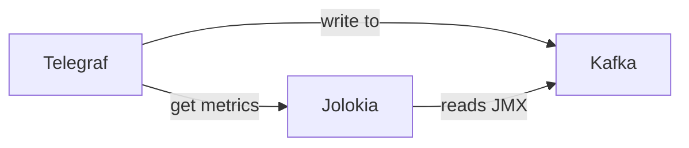

Do we have jolokia metrics ?

```bash
$ docker exec -ti monitoring-demo_kafka_1 kafka-console-consumer.sh  --zookeeper zookeeper --topic telegraf | grep jolokia
jolokia,host=cde5575b52a5,jolokia_name=kafka,jolokia_port=8778,jolokia_host=kafka heap_memory_usage_used=188793344,messages_in_MeanRate=12.98473084303969,bytes_out_FiveMinuteRate=1196.4939381458667,bytes_out_RateUnit="SECONDS",active_controller_Value=1,heap_memory_usage_init=1073741824,heap_memory_usage_committed=1073741824,messages_in_FiveMinuteRate=4.794914163942757,messages_in_EventType="messages",isr_expands_Count=0,isr_expands_FiveMinuteRate=0,isr_expands_OneMinuteRate=0,messages_in_RateUnit="SECONDS",bytes_in_FifteenMinuteRate=995.4606306690374,bytes_out_OneMinuteRate=3453.5697437249646,bytes_out_Count=413240,offline_partitions_Value=0,isr_shrinks_OneMinuteRate=0,messages_in_FifteenMinuteRate=1.8164700620801133,messages_in_OneMinuteRate=11.923477587504813,bytes_in_Count=955598,bytes_in_MeanRate=7110.765507856953,isr_shrinks_Count=0,isr_expands_RateUnit="SECONDS",isr_shrinks_EventType="shrinks",isr_expands_MeanRate=0,bytes_in_RateUnit="SECONDS",bytes_in_OneMinuteRate=6587.34465794122,bytes_in_FiveMinuteRate=2631.3776025779002,bytes_out_EventType="bytes",isr_shrinks_FiveMinuteRate=0,isr_expands_EventType="expands",messages_in_Count=1745,bytes_out_MeanRate=3074.982298604404,isr_expands_FifteenMinuteRate=0,heap_memory_usage_max=1073741824,bytes_in_EventType="bytes",bytes_out_FifteenMinuteRate=438.0280170256858,isr_shrinks_MeanRate=0,isr_shrinks_RateUnit="SECONDS",isr_shrinks_FifteenMinuteRate=0 1508889300000000000
jolokia,jolokia_name=kafka,jolokia_port=8778,jolokia_host=kafka,host=cde5575b52a5 bytes_in_MeanRate=6630.745414108696,isr_shrinks_RateUnit="SECONDS",isr_expands_EventType="expands",isr_expands_FiveMinuteRate=0,isr_expands_RateUnit="SECONDS",heap_memory_usage_max=1073741824,messages_in_Count=1745,isr_expands_FifteenMinuteRate=0,bytes_out_RateUnit="SECONDS",isr_shrinks_OneMinuteRate=0,isr_shrinks_FifteenMinuteRate=0,isr_shrinks_MeanRate=0,messages_in_RateUnit="SECONDS",bytes_in_OneMinuteRate=5576.066868503058,messages_in_FifteenMinuteRate=1.796398775034883,bytes_in_FiveMinuteRate=2545.1107836610863,bytes_out_Count=413240,active_controller_Value=1,isr_expands_Count=0,heap_memory_usage_committed=1073741824,messages_in_EventType="messages",bytes_in_Count=955598,isr_expands_OneMinuteRate=0,messages_in_FiveMinuteRate=4.637718179794651,messages_in_MeanRate=12.107909165680097,isr_shrinks_Count=0,isr_shrinks_EventType="shrinks",bytes_in_FifteenMinuteRate=984.461178226918,offline_partitions_Value=0,bytes_out_OneMinuteRate=2923.3836736983444,bytes_out_EventType="bytes",isr_shrinks_FiveMinuteRate=0,isr_expands_MeanRate=0,bytes_in_EventType="bytes",bytes_out_MeanRate=2867.3907911149618,messages_in_OneMinuteRate=10.093005874965653,bytes_in_RateUnit="SECONDS",bytes_out_FifteenMinuteRate=433.18797795919676,bytes_out_FiveMinuteRate=1157.2682011038034,heap_memory_usage_init=1073741824,heap_memory_usage_used=189841920 1508889310000000000
```

Well looks like we do !

## Getting these Errors:

```
kibana_1                      | {"type":"log","@timestamp":"2022-07-29T04:34:04Z","tags":["warning","elasticsearch","admin"],"pid":1,"message":"Unable to revive connection: http://elasticsearch:9200/"}
kibana_1                      | {"type":"log","@timestamp":"2022-07-29T04:34:04Z","tags":["warning","elasticsearch","admin"],"pid":1,"message":"No living connections"}
logstash_1                    | 04:34:04.653 [Ruby-0-Thread-5: /usr/share/logstash/vendor/bundle/jruby/1.9/gems/logstash-output-elasticsearch-7.4.3-java/lib/logstash/outputs/elasticsearch/http_client/pool.rb:228] INFO  logstash.outputs.elasticsearch - Running health check to see if an Elasticsearch connection is working {:healthcheck_url=>http://elasticsearch:9200/, :path=>"/"}
logstash_1                    | 04:34:04.658 [Ruby-0-Thread-5: /usr/share/logstash/vendor/bundle/jruby/1.9/gems/logstash-output-elasticsearch-7.4.3-java/lib/logstash/outputs/elasticsearch/http_client/pool.rb:228] WARN  logstash.outputs.elasticsearch - Attempted to resurrect connection to dead ES instance, but got an error. {:url=>"http://elasticsearch:9200/", :error_type=>LogStash::Outputs::ElasticSearch::HttpClient::Pool::HostUnreachableError, :error=>"Elasticsearch Unreachable: [http://elasticsearch:9200/][Manticore::SocketException] Connection refused (Connection refused)"}
kibana_1                      | {"type":"log","@timestamp":"2022-07-29T04:34:06Z","tags":["warning","elasticsearch","admin"],"pid":1,"message":"Unable to revive connection: http://elasticsearch:9200/"}
kibana_1                      | {"type":"log","@timestamp":"2022-07-29T04:34:06Z","tags":["warning","elasticsearch","admin"],"pid":1,"message":"No living connections"}
kibana_1                      | {"type":"log","@timestamp":"2022-07-29T04:34:06Z","tags":["warning","elasticsearch","admin"],"pid":1,"message":"Unable to revive connection: http://elasticsearch:9200/"}
kibana_1                      | {"type":"log","@timestamp":"2022-07-29T04:34:06Z","tags":["warning","elasticsearch","admin"],"pid":1,"message":"No living connections"}
^CGracefully stopping... (press Ctrl+C again to force)
Stopping grafana-monitoring-elastic-tick-kafka-ksql-c3-prometheus_zookeeper_1                  ... done
Stopping grafana-monitoring-elastic-tick-kafka-ksql-c3-prometheus_grafana_1                    ... done
Stopping grafana-monitoring-elastic-tick-kafka-ksql-c3-prometheus_chronograf_1                 ... done
Stopping grafana-monitoring-elastic-tick-kafka-ksql-c3-prometheus_kapacitor_1                  ... done
Stopping grafana-monitoring-elastic-tick-kafka-ksql-c3-prometheus_influxdb_1                   ... done
Stopping grafana-monitoring-elastic-tick-kafka-ksql-c3-prometheus_metricbeat_1                 ... done
Stopping grafana-monitoring-elastic-tick-kafka-ksql-c3-prometheus_logspout_1                   ... done
Stopping grafana-monitoring-elastic-tick-kafka-ksql-c3-prometheus_logstash_1                   ... done
Stopping grafana-monitoring-elastic-tick-kafka-ksql-c3-prometheus_kibana_1                     ... done
Stopping grafana-monitoring-elastic-tick-kafka-ksql-c3-prometheus_elasticsearch_1              ... done
Stopping cdf6d2559676_grafana-monitoring-elastic-tick-kafka-ksql-c3-prometheus_example_1       ... done
```

# 10. Let's do some manual monitoring

Let's say you have some hand coded monitoring tools that you did in python or bash as such

```bash
#!/bin/bash
group=$1
kafkaHost=$2
kafkaPort=$3
kafka-consumer-groups.sh --bootstrap-server ${kafkaHost}:${kafkaPort} --group ${group} --describe 2> /dev/null \
      | tail -n +3 \
      | awk -v GROUP=${group} '{print "kafka_group_lag,group="GROUP",topic="$1",partition="$2",host="$7" current_offset="$3"i,log_end_offset="$4"i,lag="$5"i"}'
```

You have many possibilities there :

The [exec plugin](https://github.com/influxdata/telegraf/tree/master/plugins/inputs/exec) :

```
[[inputs.exec]]
  commands = ["kafka-lag.sh mygroup broker 9092"]
  timeout = "5s"
```

You can also make Telegraf listen [line protocol](https://docs.influxdata.com/influxdb/v1.3/write_protocols/line_protocol_tutorial/) metrics on a [socket](https://github.com/influxdata/telegraf/tree/master/plugins/inputs/socket_listener)

**Note:** Telegraf has many networking options and protocols supported.

```
[[inputs.socket_listener]]
    service_address = "tcp://:8094"
```

You would then update your bash to send the data to telegraf!

```bash
#!/bin/bash
group=$1
kafkaHost=$2
kafkaPort=$3
telegrafHost=$4
telegrafPort=$5
echo Fetching metrics for the ${group} group in ${kafkaHost}:${kafkaPort} and pushing the metrics into ${telegrafHost}:${telegrafPort}
while true
do
    kafka-consumer-groups.sh --bootstrap-server ${kafkaHost}:${kafkaPort} --group ${group} --describe 2> /dev/null \
         | tail -n +3 \
         | awk -v GROUP=${group} '{print "kafka_group_lag,group="GROUP",topic="$1",partition="$2",host="$7" current_offset="$3"i,log_end_offset="$4"i,lag="$5"i"}' \
         | nc ${telegrafHost} ${telegrafPort}
         echo Sleeping for 10s
         sleep 10s
done
```

The bash telemetry story

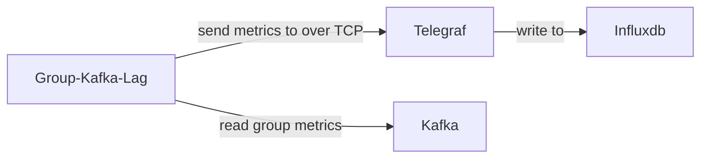

Run the demo `docker-compose -f docker-compose-step9.yml up`

You can now graph on slowness of consumers.

## Getting these Errors:

```
cdf6d2559676_grafana-monitoring-elastic-tick-kafka-ksql-c3-prometheus_example_1 exited with code 0
kibana_1                      | {"type":"log","@timestamp":"2022-07-29T04:41:26Z","tags":["warning","elasticsearch","admin"],"pid":1,"message":"Unable to revive connection: http://elasticsearch:9200/"}
kibana_1                      | {"type":"log","@timestamp":"2022-07-29T04:41:26Z","tags":["warning","elasticsearch","admin"],"pid":1,"message":"No living connections"}
kibana_1                      | {"type":"log","@timestamp":"2022-07-29T04:41:26Z","tags":["warning","elasticsearch","admin"],"pid":1,"message":"Unable to revive connection: http://elasticsearch:9200/"}
kibana_1                      | {"type":"log","@timestamp":"2022-07-29T04:41:27Z","tags":["warning","elasticsearch","admin"],"pid":1,"message":"No living connections"}
kibana_1                      | {"type":"log","@timestamp":"2022-07-29T04:41:27Z","tags":["warning","elasticsearch","admin"],"pid":1,"message":"Unable to revive connection: http://elasticsearch:9200/"}
kibana_1                      | {"type":"log","@timestamp":"2022-07-29T04:41:27Z","tags":["warning","elasticsearch","admin"],"pid":1,"message":"No living connections"}
logstash_1                    | 04:41:27.690 [Ruby-0-Thread-5: /usr/share/logstash/vendor/bundle/jruby/1.9/gems/logstash-output-elasticsearch-7.4.3-java/lib/logstash/outputs/elasticsearch/http_client/pool.rb:228] INFO  logstash.outputs.elasticsearch - Running health check to see if an Elasticsearch connection is working {:healthcheck_url=>http://elasticsearch:9200/, :path=>"/"}
logstash_1                    | 04:41:27.698 [Ruby-0-Thread-5: /usr/share/logstash/vendor/bundle/jruby/1.9/gems/logstash-output-elasticsearch-7.4.3-java/lib/logstash/outputs/elasticsearch/http_client/pool.rb:228] WARN  logstash.outputs.elasticsearch - Attempted to resurrect connection to dead ES instance, but got an error. {:url=>"http://elasticsearch:9200/", :error_type=>LogStash::Outputs::ElasticSearch::HttpClient::Pool::HostUnreachableError, :error=>"Elasticsearch Unreachable: [http://elasticsearch:9200/][Manticore::SocketException] Connection refused (Connection refused)"}
chronograf_1                  | time="2022-07-29T04:41:28Z" level=info msg=Request component=server method=GET remote_addr="192.168.224.1:60862" url=/chronograf/v1/me
chronograf_1                  | time="2022-07-29T04:41:28Z" level=info msg="Response: OK" code=200 component=server remote_addr="192.168.224.1:60862" response_time="709.032µs"
^CGracefully stopping... (press Ctrl+C again to force)
Stopping grafana-monitoring-elastic-tick-kafka-ksql-c3-prometheus_slow-consumer-kafka-lag_1    ... done
Stopping grafana-monitoring-elastic-tick-kafka-ksql-c3-prometheus_fast-consumer-kafka-lag_1    ... done
Stopping grafana-monitoring-elastic-tick-kafka-ksql-c3-prometheus_telegraf_1                   ... done
Stopping grafana-monitoring-elastic-tick-kafka-ksql-c3-prometheus_slow-kafka-consumer_1        ... done
Stopping grafana-monitoring-elastic-tick-kafka-ksql-c3-prometheus_fast-kafka-consumer_1        ... done
Stopping grafana-monitoring-elastic-tick-kafka-ksql-c3-prometheus_zookeeper_1                  ... done
Stopping grafana-monitoring-elastic-tick-kafka-ksql-c3-prometheus_grafana_1                    ... done
Stopping grafana-monitoring-elastic-tick-kafka-ksql-c3-prometheus_chronograf_1                 ... done
Stopping grafana-monitoring-elastic-tick-kafka-ksql-c3-prometheus_kapacitor_1                  ... done
Stopping grafana-monitoring-elastic-tick-kafka-ksql-c3-prometheus_influxdb_1                   ... done
Stopping grafana-monitoring-elastic-tick-kafka-ksql-c3-prometheus_metricbeat_1                 ... done
Stopping grafana-monitoring-elastic-tick-kafka-ksql-c3-prometheus_logspout_1                   ... done
Stopping grafana-monitoring-elastic-tick-kafka-ksql-c3-prometheus_logstash_1                   ... done
Stopping grafana-monitoring-elastic-tick-kafka-ksql-c3-prometheus_kibana_1                     ... done
Stopping grafana-monitoring-elastic-tick-kafka-ksql-c3-prometheus_elasticsearch_1              ... done
Stopping cdf6d2559676_grafana-monitoring-elastic-tick-kafka-ksql-c3-prometheus_example_1       ... done
```

# 11. Self descriptive visualizations

Let's rely on [jdbranham-diagram-panel](https://grafana.com/plugins/jdbranham-diagram-panel) to show pretty diagram that will be live

For that we need to install a plugin, let's leverage the grafana `GF_INSTALL_PLUGINS` environment variable

```yaml
grafana:
  image: grafana/grafana:4.6.1
  ports:
    - "3000:3000"
  environment:
    GF_INSTALL_PLUGINS: jdbranham-diagram-panel
  depends_on:
    - influxdb
    - elasticsearch
```

Run the demo `docker-compose -f docker-compose-step10.yml up`

You can now create live diagrams !


https://jdbranham.github.io/grafana-diagram/


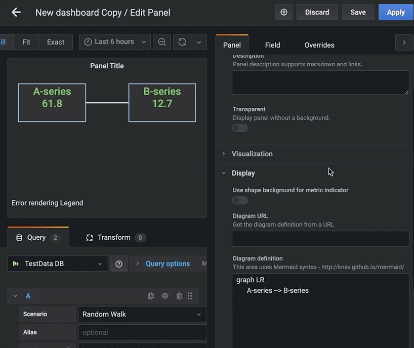
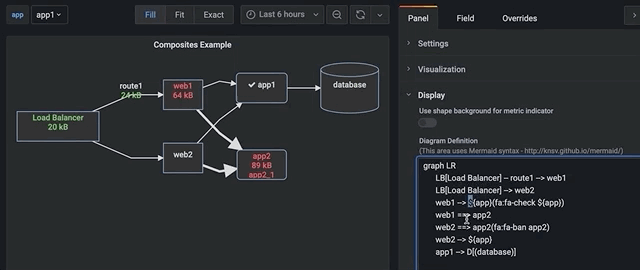

## Getting these Errors:

```
kibana_1                      | {"type":"log","@timestamp":"2022-07-29T04:47:07Z","tags":["warning","elasticsearch","admin"],"pid":1,"message":"Unable to revive connection: http://elasticsearch:9200/"}
kibana_1                      | {"type":"log","@timestamp":"2022-07-29T04:47:07Z","tags":["warning","elasticsearch","admin"],"pid":1,"message":"No living connections"}
kibana_1                      | {"type":"log","@timestamp":"2022-07-29T04:47:07Z","tags":["warning","elasticsearch","admin"],"pid":1,"message":"Unable to revive connection: http://elasticsearch:9200/"}
kibana_1                      | {"type":"log","@timestamp":"2022-07-29T04:47:07Z","tags":["warning","elasticsearch","admin"],"pid":1,"message":"No living connections"}
logstash_1                    | 04:47:08.478 [[main]>worker0] WARN  logstash.outputs.elasticsearch - UNEXPECTED POOL ERROR {:e=>#<LogStash::Outputs::ElasticSearch::HttpClient::Pool::NoConnectionAvailableError: No Available connections>}
logstash_1                    | 04:47:08.479 [[main]>worker0] ERROR logstash.outputs.elasticsearch - Attempted to send a bulk request to elasticsearch, but no there are no living connections in the connection pool. Perhaps Elasticsearch is unreachable or down? {:error_message=>"No Available connections", :class=>"LogStash::Outputs::ElasticSearch::HttpClient::Pool::NoConnectionAvailableError", :will_retry_in_seconds=>64}
logstash_1                    | 04:47:08.505 [[main]>worker1] WARN  logstash.outputs.elasticsearch - UNEXPECTED POOL ERROR {:e=>#<LogStash::Outputs::ElasticSearch::HttpClient::Pool::NoConnectionAvailableError: No Available connections>}
logstash_1                    | 04:47:08.506 [[main]>worker1] ERROR logstash.outputs.elasticsearch - Attempted to send a bulk request to elasticsearch, but no there are no living connections in the connection pool. Perhaps Elasticsearch is unreachable or down? {:error_message=>"No Available connections", :class=>"LogStash::Outputs::ElasticSearch::HttpClient::Pool::NoConnectionAvailableError", :will_retry_in_seconds=>64}
kibana_1                      | {"type":"log","@timestamp":"2022-07-29T04:47:09Z","tags":["warning","elasticsearch","admin"],"pid":1,"message":"Unable to revive connection: http://elasticsearch:9200/"}
kibana_1                      | {"type":"log","@timestamp":"2022-07-29T04:47:09Z","tags":["warning","elasticsearch","admin"],"pid":1,"message":"No living connections"}
kibana_1                      | {"type":"log","@timestamp":"2022-07-29T04:47:09Z","tags":["warning","elasticsearch","admin"],"pid":1,"message":"Unable to revive connection: http://elasticsearch:9200/"}
kibana_1                      | {"type":"log","@timestamp":"2022-07-29T04:47:09Z","tags":["warning","elasticsearch","admin"],"pid":1,"message":"No living connections"}
kibana_1                      | {"type":"log","@timestamp":"2022-07-29T04:47:09Z","tags":["warning","elasticsearch","admin"],"pid":1,"message":"Unable to revive connection: http://elasticsearch:9200/"}
kibana_1                      | {"type":"log","@timestamp":"2022-07-29T04:47:09Z","tags":["warning","elasticsearch","admin"],"pid":1,"message":"No living connections"}
kapacitor_1                   | [httpd] 192.168.224.5 - - [29/Jul/2022:04:47:10 +0000] "POST /write?consistency=&db=_internal&precision=ns&rp=monitor HTTP/1.1" 204 0 "-" "InfluxDBClient" 817bc2e2-0ef9-11ed-800d-000000000000 1153
^CGracefully stopping... (press Ctrl+C again to force)
Stopping grafana-monitoring-elastic-tick-kafka-ksql-c3-prometheus_group-kafka-lag_1            ... done
Stopping grafana-monitoring-elastic-tick-kafka-ksql-c3-prometheus_slow-kafka-consumer_1        ... done
Stopping grafana-monitoring-elastic-tick-kafka-ksql-c3-prometheus_grafana_1                    ... done
Stopping grafana-monitoring-elastic-tick-kafka-ksql-c3-prometheus_zookeeper_1                  ... done
Stopping grafana-monitoring-elastic-tick-kafka-ksql-c3-prometheus_chronograf_1                 ... done
Stopping grafana-monitoring-elastic-tick-kafka-ksql-c3-prometheus_kapacitor_1                  ... done
Stopping grafana-monitoring-elastic-tick-kafka-ksql-c3-prometheus_influxdb_1                   ... done
Stopping grafana-monitoring-elastic-tick-kafka-ksql-c3-prometheus_metricbeat_1                 ... done
Stopping grafana-monitoring-elastic-tick-kafka-ksql-c3-prometheus_logspout_1                   ... done
Stopping grafana-monitoring-elastic-tick-kafka-ksql-c3-prometheus_logstash_1                   ... done
Stopping grafana-monitoring-elastic-tick-kafka-ksql-c3-prometheus_kibana_1                     ... done
Stopping grafana-monitoring-elastic-tick-kafka-ksql-c3-prometheus_elasticsearch_1              ... done
Stopping cdf6d2559676_grafana-monitoring-elastic-tick-kafka-ksql-c3-prometheus_example_1       ... done
```

# 12. Your sql databases are back

**Note:** Todo

Leverage your sql databases in your grafana dashboards with http://docs.grafana.org/features/datasources/mysql/

You can consume your database changes and push them to kafka https://www.confluent.io/product/connectors/

# 13. Share your database tables as kafka table

Change Data Capture and [Kafka connect](https://kafka.apache.org/documentation/#connect)
Look at the ecosystem : https://www.confluent.io/product/connectors/

# 14. Going even further with Kafka using KSQL

**Note:** Todo

Now that Kafka is the real bus of your architecture, you can leverage [ksql](https://github.com/confluentinc/ksql) declarative power such as

```sql
CREATE TABLE possible_fraud AS
  SELECT card_number, count(*)
  FROM authorization_attempts
  WINDOW TUMBLING (SIZE 5 SECONDS)
  GROUP BY card_number
  HAVING count(*) > 3;
```

# 15. Going C3

**Note:** Todo

Now that kafka, ksql, connect is driving many parts of your monitoring, you want to have a dedicated tool that will enrich your existing metrics/visualizations : https://www.confluent.io/product/control-center/

# 16. Going Prometheus

**Note:** Todo

https://prometheus.io/

# 17. Going distributed open tracing

**Note:** Todo

http://opentracing.io/

# 18. Monitoring Federation

**Note:** Todo

Have a global overview of many clusters.

# 19. Security

**Note:** Todo

Always a bit of a pain.
